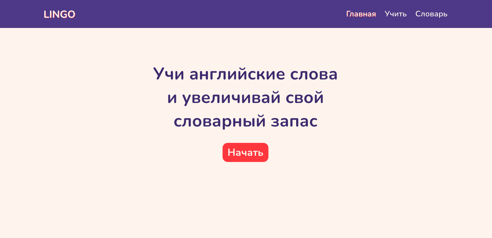

#Lingo
Lingo is an app for learning English words.

## Result:




## Technologies:

<code></code>
<code></code>
<code></code>
<code></code>
<code></code>
<code></code>

```bash
# Clone this repository
$ git clone https://github.com/goncharovastacy/Lingo.git

# Go into the repository
$ cd Lingo

# Install dependencies
$ npm install

# Run the app
$ npm start
```
